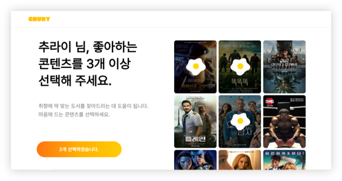
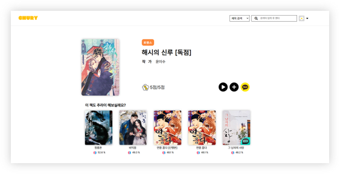

# CHURY - 디지털 도서 추천 서비스
Django + Python을 이용한 Web Project 입니다.
  

## 🖥️ 프로젝트 소개
영상매체에 익숙해져 독서량이 감소해가는 현대인들에게 그들이 관심있는 영상 콘텐츠와 유사한 장르의 디지털 도서를 추천해줌으로써 독서에 흥미를 느낄 수 있게 만들어 주자는 취지에서 개발하게 되었습니다.

 

### 🕰️ 개발 기간
- 1차 : 2022.10.19 ~ 2022.11.10
- 2차 : 2023.01.09 ~ 2023.01.19
- 3차 : 2023.03.13 ~ 2023.03.16
- 총 약 30일

 

### 👩🏻‍💻 조원 소개
- 박정현(조장) : 검색 기능, 도서 저장 기능, 시각화, 카카오, 네이버 소셜 로그인, 카카오페이 API

- 김지원 : 영화 콘텐츠 선택 기능, 별점 기능, 추천 알고리즘 구현, 도서 상세보기 기능, 데이터 전처리

- 정윤균 : 추천 알고리즘 구현, TMDB API 사용, DB 구축, 회원가입, 로그인 기능, 데이터 전처리

- 홍세빈 : 배너 image slider, 2단계 인증 기능, 비밀번호 찾기, 카카오 공유 API 사용, 템플릿 디자인

 

### 🛠️ 개발 환경
- 
Frontend 

&nbsp;&nbsp;&nbsp;&nbsp;&nbsp;

- 
Backend 

&nbsp;&nbsp;&nbsp;&nbsp;&nbsp;

- 
Database 

&nbsp;&nbsp;&nbsp;&nbsp;&nbsp;

- 
VCS

&nbsp;&nbsp;&nbsp;&nbsp;&nbsp;

- 
Editor 

&nbsp;&nbsp;&nbsp;&nbsp;&nbsp;

- 
API 

&nbsp;&nbsp;&nbsp;&nbsp;&nbsp;

  

## 🦾 주요 기능
- 사용자가 선택한 영상 콘텐츠 기반 추천

 

- 사용자가 선택한 도서 기반 추천

 

- 취향이 유사한 다른 유저 기반 추천

 

## 📑 CHURY 사용법
- read.txt에 있는 pip install 명령어 입력
- py manage.py runserver